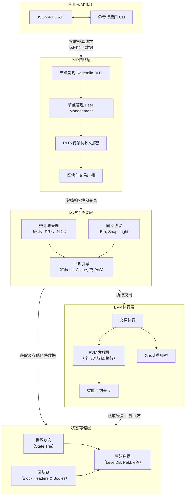

# Go-Ethereum 核心功能与架构设计
## 理论分析
### 1. 阐述Geth在以太坊生态中的定位
Geth(Go Ethereum)是以太坊生态中的执行节点，在早期版本中Geth是作为全节点的，在以太坊从PoW切换到PoS之后，Geth仅作为执行节点，需要和共识节点配合工作。

以太坊客户端包含两种，execution client与consensus client。执行客户端（Geth）负责**交易处理、交易传播、状态管理以及支持以太坊虚拟机（EVM）**。然而，Geth 不负责区块构建、区块传播或处理共识逻辑。这些工作由共识客户端负责。

### 2. 解析核心模块交互关系：
- 核心模块
    - 区块链同步协议 eth/69,snap/1
    - 交易池管理与Gas机制
    - EVM 执行环境构建
    - 共识算法实现（Ethash/POS）

- 节点同步与初步验证
    - ETH协议模块启动同步模式，快照同步或者全量同步。
    - 区块插入时，调用共识模块验证区块头，之后调用EVM执行区块体，执行完成后返回结果给共识模块，共识模块决定区块是否有效。
    - 新的区块头到达时，重置交易池的状态。

- 交易传播
    - ETH协议模块中的处理器hander启动时，订阅交易池的新交易事件，并启动交易广播循序，从交易池接收新交易事件，并立即广播。

- 交易执行与区块提案
    - ETH协议模块收到共识客户端的区块构建指令，开始构造区块。
    - 从内存交易池中选择交易，交给EVM执行交易，计算费用。
    - EVM执行完之后，交给共识模块处理共识奖励和质押提款（withdraw）。
    - 共识层验证，插入区块链，广播区块。
    - 共识层证明投票，事件发送，交易池重置。


## 架构设计
### 1. 分层架构图


### 2. 关键模块
#### P2P网络层 - 路由表 DHT
- buckets: 17个距离桶（节点ID的XOR距离），每个桶最多能存放是16个活跃节点和10个替换节点。
- nursery: bootstrap节点，用于初始化。
- 防女巫攻击
    - 每个桶中最多2个/24子网的节点，整个表最多10个/24子网节点
    - 桶满时，新节点只能进入替换列表，不能直接提出现有节点
    - 拒绝初始化期间的入站节点

#### 协议层 - 快照同步协议 Snap Sync
- 快照同步不会从创世区块开始同步，而是从一个较近的区块开始同步到区块链的头部。区块头由共识客户端提供。
- 当区块头同步完成之后，开始下载区块体和Receipts信息，同时开始状态同步（state sync）。在内存中只保留最近的128个区块状态，除此之外，节点只会保存一些快照用来事实重建中间状态。state sync 将世界状态数切分并行下载，再重建。
- 最后，修复状态healing state，并更新最新的数据。

#### 状态存储层 - 默克尔树 MPT
- MPT树包含了三种节点：Leaf Node，Extension Node, Branch Node，叶子节点中记录key-end和value值，扩展节点中记录的是公共前缀，分支节点采用0-f的槽位作为下一个节点的索引。
- 编码过程
    - 半字节前缀编码HP，对于叶子节点与扩展节点中的key，进行压缩。
    - RLP算法，对节点内容序列化。
    - 生成节点Hash，自下而上，作为上层节点编码的一部分。
- 默克尔证明：当要验证某个节点时，只要提供这个叶子节点的内容，以及到根节点的路劲上所以需要的哈希，就可以证明这个节点在树中。

#### 区块数据解构
```
type Header struct {
    ParentHash  common.Hash    // 父区块哈希
    UncleHash   common.Hash    // 叔块哈希  ← 你选中的 uncles 相关
    Coinbase    common.Address // 矿工地址
    Root        common.Hash    // 状态树根哈希
    TxHash      common.Hash    // 交易树根哈希
    ReceiptHash common.Hash    // 收据树根哈希
    Bloom       Bloom          // 布隆过滤器
    Difficulty  *big.Int       // 挖矿难度
    Number      *big.Int       // 区块号
    GasLimit    uint64         // Gas 限制
    GasUsed     uint64         // 已使用 Gas
    Time        uint64         // 时间戳
    Extra       []byte         // 额外数据
    MixDigest   common.Hash    // PoW 混合哈希
    Nonce       BlockNonce     // PoW 随机数

    // EIP 扩展字段
    BaseFee *big.Int         // EIP-1559: 基础费用
    WithdrawalsHash *common.Hash // EIP-4895: 提款哈希
    BlobGasUsed *uint64      // EIP-4844: Blob Gas 使用量
    ExcessBlobGas *uint64    // EIP-4844: 过量 Blob Gas
    ParentBeaconRoot *common.Hash // EIP-4788: 信标链根
    RequestsHash *common.Hash // EIP-7685: 请求哈希
}
```